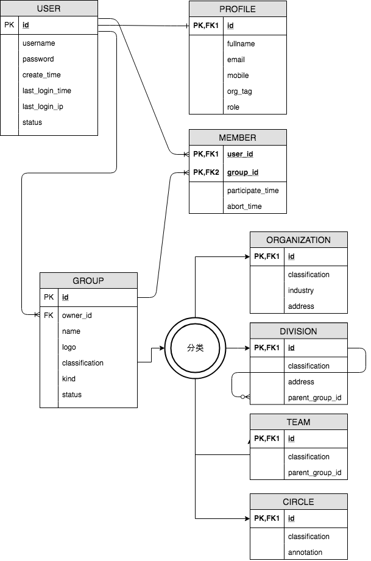
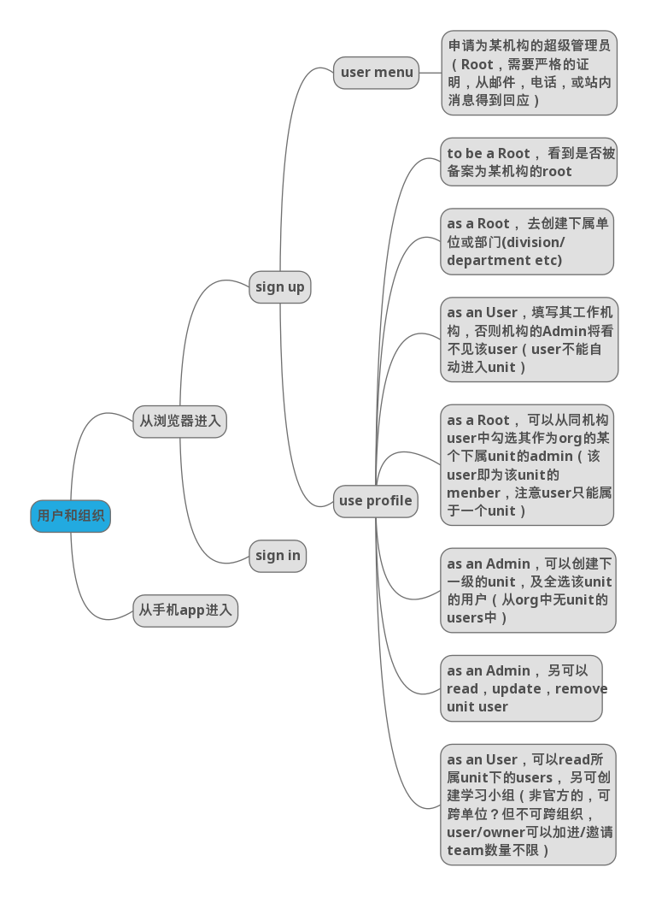

# User and Organization

Diagram

## Use Case

法定的机构需要严肃认证（如微博官方认证） _newly added_

1. 首先一职工代表该机构注册账户 （ user ）， 然后为其机构申请创建组织（group），提交证明材料， 如此时group.status＝inactive
1. 该会联网服务运行方确认， 如此时group.status＝active ， 该user是该机构的顶级管理员（role: root）， 或者说是运行方与该机构的联络人
1. root详细填写机构的属性 （ organization ）
1. 假定该user离职了？
1. 机构往往是一个名称概念， 机构中的成员其实都有部门单位， 如xxx公司，研发部门

法定机构是层级关系 _updated_

1. xx大学是机构，xx学院也是机构， 通过外键（parent_group_id）索引到上级机构xx大学
1. xx公司是机构, 同样下属机构是xx子公司, xx分公司是孙级公司

部门单位 _newly added_

1. 单位（unit）是法定机构的下属部门（ kind=department或kind＝division），如研发部，人事部等等

员工与机构以及员工与部门的关系 _newly added_

1. 员工首先作为个体注册 （ user ），为了能参在所在单位的组织活动，必须填写所在机构（org_tag），但不能主动申请加入（防止蓄意操作行为）
1. 因为有了org_tag的索引，以及缩小了查询范围， 所以root可以将该人pull进机构，并授予其为下级机构的管理员（role：org_admin）
1. 因为org_admin可以去重复类推操作，所以避免了拉人动作的都要由root去操作
1. 一个人不能同时加入2个以上的平级机构，或一个机构的2个以上部门

允许部门员工创建自发组织 _newly added_

1. 如产品a的开发团队，性质上是群（team， kind＝official）， 与部门是层级关系
1. 但允许一个员工同时加入多个team
1. 群里的新闻消息，对所属部门是可见的，但默认对部门的上级，或跨部门是不可见（避免信息泛滥）

允许个人可以创建非官方性质的组织  _newly added_

1. 这种组织是圈子(circle， kind＝individual)， 但必须同意尽责条款
1. 个人建群的尽责条款有法律依据（避免非法行为），如app中的责任条款
1. 允许user主动申请加入circle，或被circle邀请
1. 允许user主动退出circle

群体与个人的关系

1. 文学院一教师是user, 他所教课中须有学生参与, 因此, 他可以创建一个群(group), 当然这个group就形成了一个非官方组织(team), 同时还可以找到上级组织, 即文学院. 这个群主自然是该老师
1. 中电普华一项目组, 组长可以创建一个group, 而他作为创建者是群主(owner), 也是第一位member. 他所创建的team也可以找到上级组织如云计算事业部, 当然可以追溯到更上级的组织即普华
1. 个人是可以参与多个组织的， 如中电运行可以创建组织如: 18年4月安全培训班. 把学员组成team. 但该学员还属于南方电网下属的广西电力公司组织

Mind map _newly added_

## Reference

参考SaaS技术里的常用组织关系 _updated_

1. 微信, qq中可以自行建群
1. 微博中，创建机构官方号，要通过认证 
1. github上可以自行创建组织
1. gitlab上可以自行创建群
1. dockerhub上可以自行创建组织
